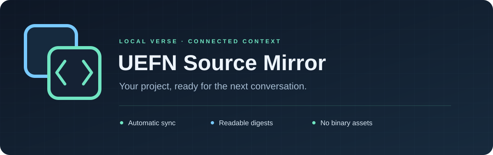

<p align="center"></p>

<p align="center">
  
  
  
</p>

**Keep your UEFN Verse project available to GitHub-connected assistants, without uploading binary assets.**

UEFN Source Mirror is a Windows tray app that copies saved Verse source and generated digests into a separate, private GitHub repository. Your UEFN project stays authoritative. The app handles change detection, commits, pushes, and readable copies of large digests.

## Features

| Feature | How it works |
| --- | --- |
| Automatic sync | Watches saved `.verse` changes and waits eight seconds for edits to settle. |
| Timer fallback | Catches missed events and folder changes; default: two minutes. |
| Manual controls | Sync now, pause/resume, per-project enable/disable, logs, and last-success status. |
| Multiple projects | Each profile has its own source, optional digest cache, mirror folder, and private repository. |
| Source context | Preserves Verse paths and adds source, folder, and large-file reading indexes. |
| Tray workflow | Close the window to keep syncing; reopen from the tray or another app launch. |

## Getting started

You need Windows, [Git](https://git-scm.com/), and [GitHub CLI](https://cli.github.com/). Building also requires the .NET 9 SDK. A self-contained build includes its .NET runtime.

1. Sign in with `gh auth login`.
2. Build using the commands below, then open **UEFN Source Mirror.exe**.
3. Choose **Add project** and browse to your UEFN project folder.
4. Check the detected Verse cache and suggested private repository name.
5. Choose **Create private mirror**. The first sync commits and pushes the snapshot.

The source must contain `Content`. The project Verse cache is usually beneath `%LOCALAPPDATA%/UnrealEditorFortnite/Saved/VerseProject/`. Select the project cache root to include asset and built-in digests. Leave it blank to mirror source only.

New mirrors default to `%LOCALAPPDATA%/UEFNSourceMirror/mirrors/`. Choose another separate folder when adding a project if preferred. A `mirrors/` folder inside this application checkout is supported and ignored by Git. Never place a mirror inside its source project or digest cache.

## Build and test

From the repository root, in PowerShell:

```powershell
dotnet publish src/VerseMirror.csproj -c Release -r win-x64 --self-contained true -p:PublishSingleFile=true -o app
& './app/UEFN Source Mirror.exe'
```

Exit the tray app before an optional command-line sync:

```powershell
$run = Start-Process './app/UEFN Source Mirror.exe' -ArgumentList '--sync' -Wait -PassThru
$run.ExitCode
```

Run the safety checks:

```powershell
$test = Start-Process './app/UEFN Source Mirror.exe' -ArgumentList '--self-test' -Wait -PassThru
if ($test.ExitCode -ne 0) { throw 'Self-tests failed' }
Get-Content "$env:LOCALAPPDATA/UEFNSourceMirror/self-test.json"
python scripts/check_public_repo.py
```

Exit codes: `0` success, `1` failure, `2` another sync instance is running. Self-tests use temporary fixtures, never configured projects or GitHub pushes. GitHub Actions builds the Windows app and runs the checks. The checked-in icon is sufficient for building; `make_icon.py` optionally regenerates it with Pillow.

## Mirror contents

```text
Content/                  Original Verse files, original relative paths
Digests/                  Generated Verse cache, original relative paths
Readable/                 Small reading copies of large Verse files
SOURCE_INDEX.md           Links to original Verse files
READABLE_INDEX.md         Ordered parts with original line ranges
FOLDERS.md                Directories, including binary-only folders
mirror-manifest.json      Names and counts of managed files
```

Original files are copied byte for byte. Files over 500 KB also get indexed UTF-8 reading copies: some GitHub contents readers return empty content for large files. Classes/modules can span parts; read adjacent parts in order.

Binary assets, credentials, editor caches, symlinks/junctions, and Git/URC/tool internals are excluded. Binary-only directories appear in `FOLDERS.md`; Git does not track empty folders. Digests reflect whatever UEFN last generated. Syncing does not compile Verse or regenerate digests.

## GitHub-connected assistants

Grant the integration access to the **private project mirror**, then ask it to read `SOURCE_INDEX.md` and relevant source paths. If a digest returns empty content, use `READABLE_INDEX.md`. Code search can lag behind pushes; fetching a known path is a useful fallback.

This public repository contains the application only. Each user's project mirrors remain separate and private.

## Local data and safety

Profiles, paths, status, logs, and reports stay under `%LOCALAPPDATA%/UEFNSourceMirror/`. Authentication uses GitHub CLI's sign-in; no tokens are stored in profiles. **Start at sign-in** controls an optional per-user startup entry.

Before syncing, the app validates source/cache availability, separate roots, repository root, `main`, expected origin, and remote privacy. Missing caches and empty sources stop a scan before pruning. Only manifest-owned files are removed. Binary content disguised as Verse is rejected.

Pushes never force or automatically merge. Treat the mirror as read-only: local source can replace edits to mirrored files. Conflicting remote commits require manual reconciliation. Network/authentication failures appear in the app/log and retry on later scans. The app must be running for automatic sync.

## Contributing and license

See [CONTRIBUTING.md](CONTRIBUTING.md). Keep personal paths, profiles, project content, logs, and unredacted screenshots out of commits. A privacy audit checks tracked files and reachable history.

[MIT](LICENSE). This independent utility is not an Epic Games product. The application license does not grant rights to project content or generated digests.
